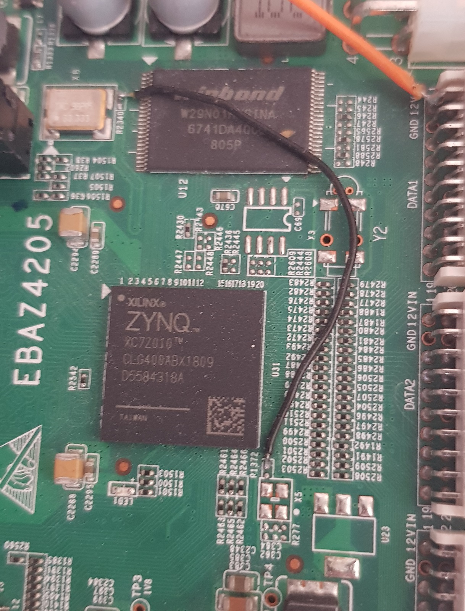
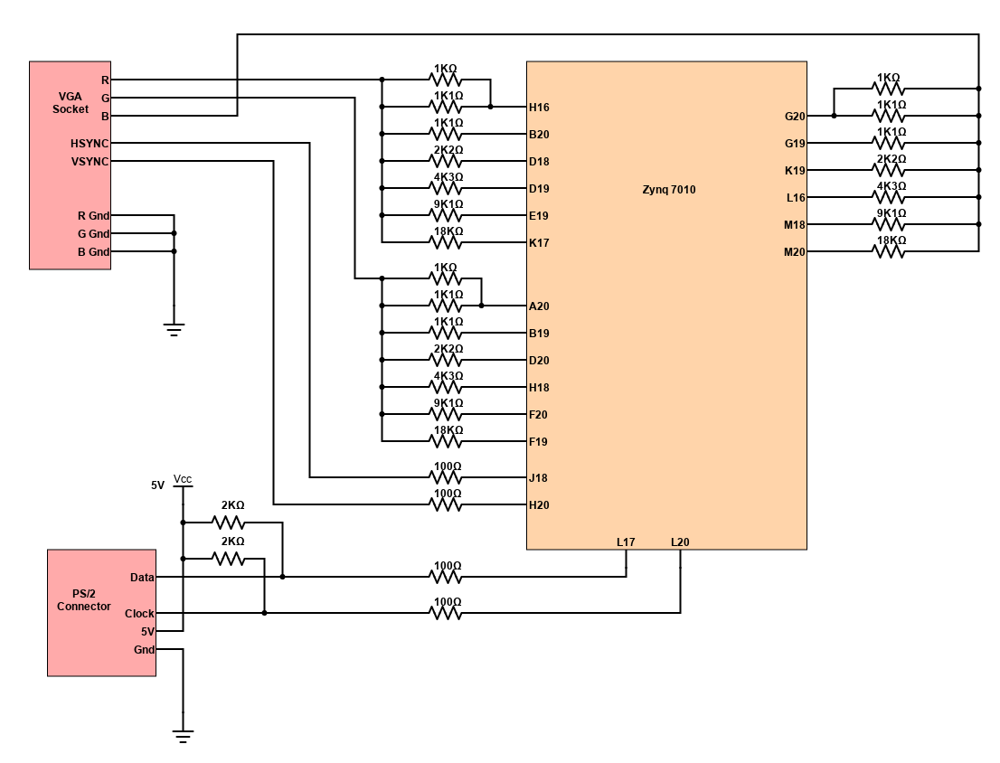
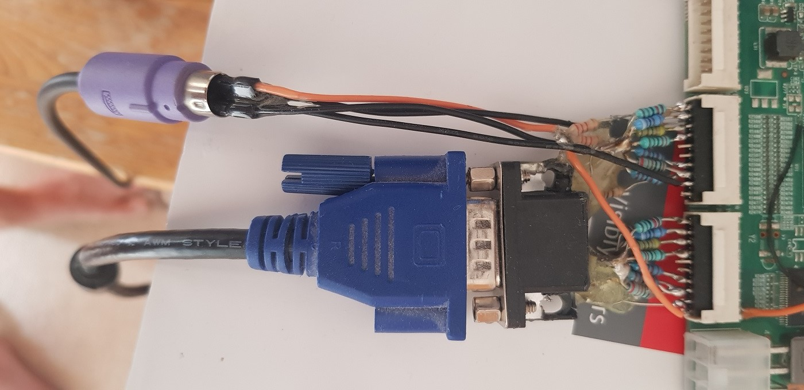
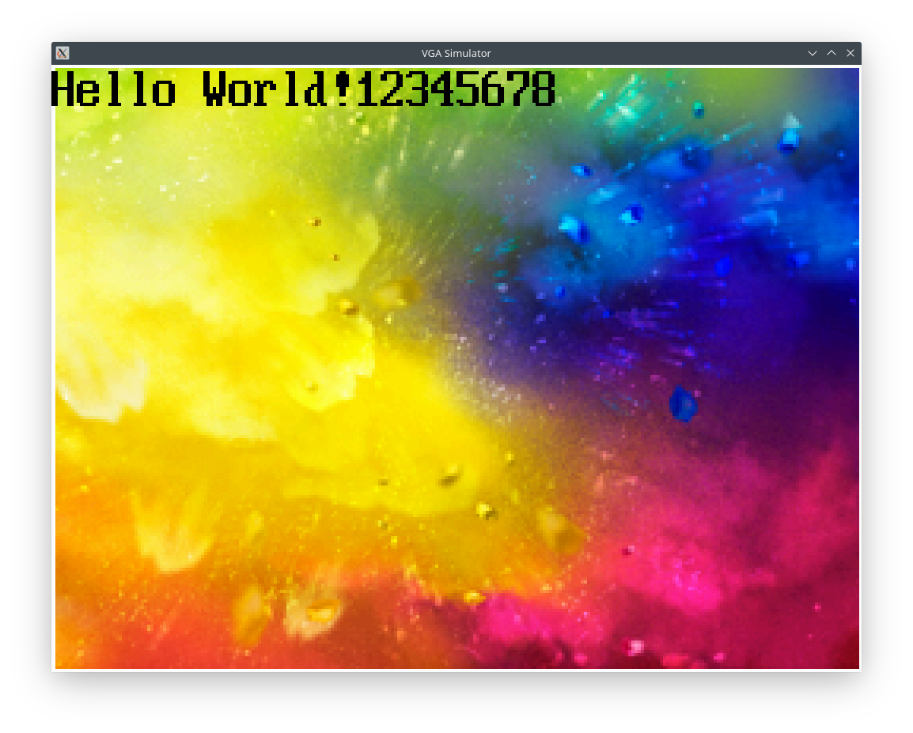

# vga_interface

A functional FPGA VGA and PS/2 Keyboard interface written in SystemVerilog including a console that lets you type text on a screen.


## Source
rtl/ includes the SystemVerilog logic and top level modules for a real FPGA and for simulation.

## Project
project/ includes the Vivado project files targeting an ebaz4205 FPGA.

The project uses the 33.333 Mhz PS clock of the ebaz board which has to be manually connected to package pin N18 as seen the following picture.



To physical VGA connection requires a resistor network DAC. The 18bit interface is implemented in the following way.




## Simulator
sim/ Includes a Verilator based simulator.
It uses MiniFb to display the VGA frames in real time in a window and also includes support for basic keyboard inputs.  



To run the simulator MiniFB has to be built first:

```
cd sim\minifb
mkdir build
cd build
cmake .. -DUSE_OPENGL_API=OFF -DUSE_WAYLAND_API=OFF
make
cd ../..
```

Then you can run the simulator with:
```
make && ./obj_dir/Vvgasim_window
```


## Acknowledgements
MiniFB: https://github.com/emoon/minifb \
The PS/2 keyboard controller is based on https://forum.digikey.com/t/ps-2-keyboard-to-ascii-converter-vhdl/12616 and was portet to SystemVerilog. \
The VGA resistor network DAC is based on http://retroramblings.net/?p=190. \
The font file and inspiration is taken from https://github.com/dmitrybarsukov/fpga-text-to-vga. \
https://github.com/gipi/electronics-notes/tree/master/fpga/mojo/VGAGlyph was a very useful recource helping me to implement the simulator. \


